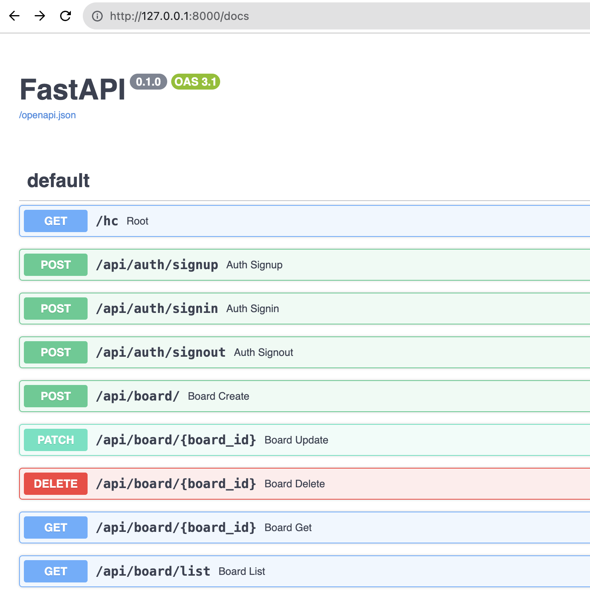

### 2023 Alice Backend Team Interview Project 

## About
2023 앨리스 백엔드 팀 인터뷰를 위한 프로젝트입니다.

### API Specification

[API Document is auto generated by Swagger UI](https://fastapi.tiangolo.com/features/#automatic-docs).




### Table of Contents
 - [About](#About)
    - [API Specification](#api-specification)
    - [Table of Contents](#table-of-contents)
    - [Prerequisites](#prerequisites)
    - [Getting Started](#getting-started)
        - [Setting Redis and Postgres](#setting-redis-and-postgres)
        - [Running Development Server](#running-development-server)
        - [API Testing](#api-testing)
    - [Folder Structure](#folder-structure)
    - [Built With](#built-with)
    - [Author](#author)

### Prerequisites
**You'll need to have Python 3.10 or later on your local development machine.**

We recommend to use venv to isolate enviroments from other projects.

or you can run server inside docker container
```bash
$ python --version 
Python 3.10.11
```

**Redis**

We expect Redis server to be running on port 25100. 

This can be easily done using docker compose. Please look at [here](#setting-redis-and-postgres)


**Postgres**

We expect Postgres server to be running on port 25000. 

This can be easily done using docker compose. Please look at [here](#setting-redis-and-postgres)

**Environment Secrets**

List of environment variables required are specified in [here](https://github.com/jinho-choi123/2023_Alice_Backend_Interview_Project/blob/main/.config/.env.example)

**!Important: Please be careful not to upload any kind of secrets on github**


### Getting Started

#### Setting Redis and Postgres
Run the following commands to setup redis and postgres server.
Please refer to [docker-compose.yml](https://github.com/jinho-choi123/2023_Alice_Backend_Interview_Project/blob/main/.docker/docker-compose.yml) to get more info.
```bash
$ docker compose -f .docker/docker-compose.yml -p 2023-alice-project up -d
```


#### Running Development Server
```text
You need Postgres and Redis running on your local machine before running our server.
```
Run Dev server
```bash
# create .config/.env
$ cp .config/.env.example .config/.env

# fill out .env file 
$ vim .config/.env

# check if python 3.10 or above is installed
$ python --version

# setup python venv
$ python -m venv .venv 
$ source .venv/bin/activate

# install required packages
$ pip install -r requirements.txt

# run fast api server with hot reload
$ uvicorn main:app --reload
```

#### API testing
```bash
# You can run API Tests by running the following command in your project root
# Make sure you activated python venv
$ python -m pytest -v
```
**If you want to add your custom testing, then add test_{your test name}.py to src/tests directory. Also refer to [Fast API Testing](https://fastapi.tiangolo.com/tutorial/testing/).**


### Folder Structure
```text
2023-alice-backend-interview-project
.
├── README.md
├── config.py
├── main.py
├── requirements.txt
├── src
│   ├── controller
│   │   ├── authController.py
│   │   ├── boardController.py
│   │   └── postController.py
│   ├── db
│   │   ├── database.py
│   │   └── models.py
│   ├── middlewares
│   │   └── authMiddleware.py
│   ├── routers
│   │   ├── authRouter.py
│   │   ├── boardRouter.py
│   │   ├── index.py
│   │   └── postRouter.py
│   ├── tests
│   │   ├── test_auth.py
│   │   ├── test_board.py
│   │   ├── test_hc.py
│   │   ├── test_post.py
│   │   └── test_private_board.py
│   ├── types
│   │   ├── authTypes.py
│   │   ├── boardTypes.py
│   │   ├── postTypes.py
│   │   └── userTypes.py
│   └── utils
│       ├── hash.py
│       ├── session.py
│       └── test_db_setup.py
└── static
    └── api-document-screenshot.png
```

### Built With
- [FastAPI](https://fastapi.tiangolo.com/) - Used to build server.
- [SQLAlchemy](https://www.sqlalchemy.org/) - Fancy Python ORM
- [Postgres](https://www.postgresql.org/) - World's Most Advanced Open Source Relational Database
- [Redis](https://redis.io/) - Open Source in-memory data store
- [Docker](https://www.docker.com/) - OS-level virtualization tool

### Author
 - **ball** - [Ball](https://github.com/jinho-choi123)